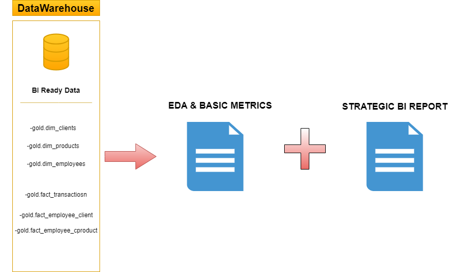
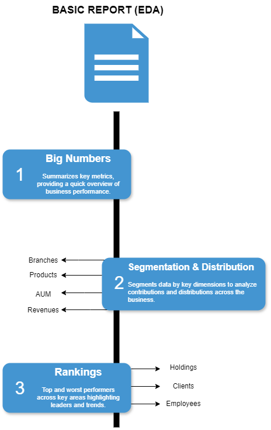
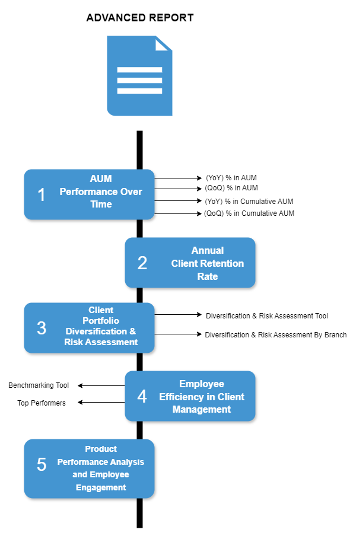

# Introduction

This is a data analysis project that follows up on my data engineering work, where I developed an end-to-end, on-premise data warehouse for an investment firm (You can find the full data engineering project [here](https://github.com/theodorosmalezidis/DWH_project/tree/main)).

# Goals

The purpose of this phase is to extract meaningful insights from the structured data, focusing on business performance metrics across clients, employees, and investment products. Through a basic and an advanced analytical report, this phase demonstrates how the data warehouse enables informed decision-making.Feel free to check the scripts [here](https://github.com/theodorosmalezidis/Investment_Firm_Analytics/tree/main/Reports).

# Dataset

I used the views created in the final layer (gold layer) in the DataWarehouse.

# My Tools for the Project

- **SQL Server (SQLS):**  A powerful database system I used to store my data and run fast, efficient queries. 
- **SQL:**  The go-to language I used to interact with my data. 
- **Git:**  My trusty version control tool that helped me keep track of changes. 
- **GitHub:**  Where I shared my SQL scripts and kept everything organized, making it easier to track progress. 
- **Draw.io:**  I used this tool to create clear visual documentation of how my data analysis reports are structured and organized.

# Overview

## Report Structure

I split my report into two parts, basic report (EDA) focused on providing a high-level overview through summary statistics, categorization, and rankings, and advanced report for deeper insights through performance metrics, trend analysis, and risk evaluation.

*Image created with draw.io*

## A) Basic Report (EDA)

*Image created with draw.io*

You can see the report [here](https://github.com/theodorosmalezidis/Investment_Firm_Analytics/tree/main/Reports/Basic%20Report%20(EDA)).

## A) Basic Report (EDA)

*Image created with draw.io*

You can see the report [here](https://github.com/theodorosmalezidis/Investment_Firm_Analytics/tree/main/Reports/Advanced%20Report).