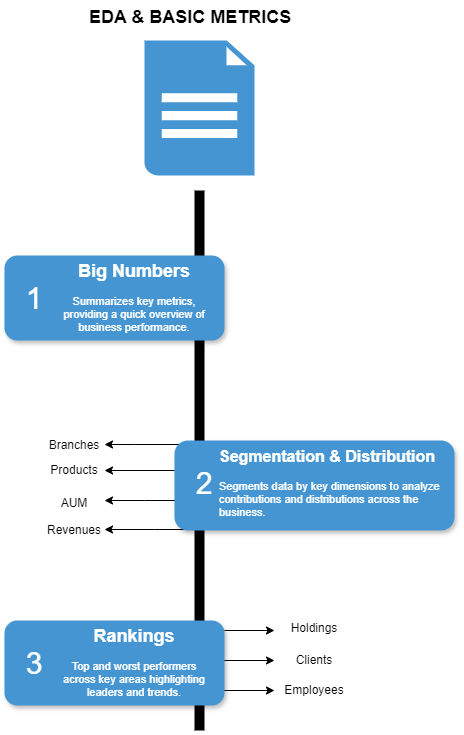

# Introduction

After the Data Warehouse was successfully deployed (you can find the full data engineering project [here](https://github.com/theodorosmalezidis/DWH_project/tree/main))
,my job wasn' t done. In this business scenario, the firm’s stakeholders required for "Data Interpretation". They needed solutions in problems like distinguishing organic growth from seasonal spikes, they couldn't quantify their employee’s productivity or assess products contribution to revenue, and they needed clear answers about the client retention rate to understand churn risk.

# Goals

Create an analytical framework to answer some critical questions so they can assess the company s performance so far and to guide the upcoming fiscal year's strategy:

-**Is the firm actually growing?**

-**Who and what is driving our growth?**

-**Are our clients staying with us?**

-**How can we assess risk in clients’ portfolios to ensure stability in firms’ structure?**

To provide these answers, I structured the analysis into two distinct reports:

-**EDA & Basic Metrics**

-**Strategic BI Report**

Feel free to check the report queries [here](https://github.com/theodorosmalezidis/Investment_Firm_Analytics/tree/main/Reports).

# Dataset

I used the views created in the final layer (gold layer) in the DataWarehouse.

# My Tools for the Project

- **SQL Server (SQLS):**  A powerful database system I used to store my data and run fast, efficient queries. 
- **SQL:**  The go-to language I used to interact with my data.
- **VSCode:**  A versatile code editor I used to integrate with GitHub to create and format my documentation and manage project files.
- **Git:**  My trusty version control tool that helped me keep track of changes. 
- **GitHub:**  Where I shared my SQL scripts and kept everything organized, making it easier to track progress. 
- **Draw.io:**  I used this tool to create clear visual documentation of how my data analysis reports are structured and organized.
- **Python (via Jupyter Notebook in Anaconda):** I used Python with Anaconda to import SQL query results and produce visualizations, such as bar charts, for deeper analysis.

# Overview

## Report Structure

So i split my report into two parts, EDA & Basic Metrics focused on providing an overview of the firm's summary statistics, and Strategic BI Report to deliver tools and actionable solutions to the stakeholders' core business problems.

*Image created with draw.io*

## A) EDA & Basic Metrics

*Image created with draw.io*

You can see the report [here](https://github.com/theodorosmalezidis/Investment_Firm_Analytics/tree/main/Reports/Basic%20Report%20(EDA)).

## B) Strategic BI Report 

*Image created with draw.io*

You can see the report [here](https://github.com/theodorosmalezidis/Investment_Firm_Analytics/tree/main/Reports/Advanced%20Report).