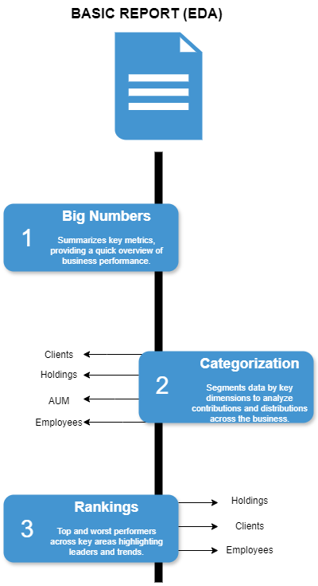

# Introduction

This is a data analysis project that follows up on my data engineering work, where I developed an end-to-end, on-premise data warehouse for an investment firm (You can find the full data engineering project [here](https://github.com/theodorosmalezidis/DWH_project/tree/main)).

# Goals

The purpose of this phase is to extract meaningful insights from the structured data, focusing on business performance metrics across clients, employees, and investment products. Through a basic and an advanced analytical report, this phase demonstrates how the data warehouse enables informed decision-making.Feel free to check the scripts [here](https://github.com/theodorosmalezidis/Investment_Firm_Analytics/tree/main/Reports).

# Dataset

I used the views created in the final layer (gold layer) in the DataWarehouse.

# My Tools for the Project


- **SQL Server (SQLS):**  A powerful database system I used to store my data and run fast, efficient queries. 
- **SQL:**  The go-to language I used to interact with my data. 
- **Git:**  My trusty version control tool that helped me keep track of changes. 
- **GitHub:**  Where I shared my SQL scripts and kept everything organized, making it easier to track progress. 
- **Draw.io:**  I used this tool to create clear visual documentation of how my data analysis reports are structured and organized.

# Overview

## Report Structure

I split my report into two parts, basic report (EDA) focused on providing a high-level overview through summary statistics, categorization, and rankings, and advanced report for deeper insights through performance metrics, trend analysis, and risk evaluation.


*Image created with draw.io*

## A) Basic Report (EDA)



*Image created with draw.io*

There are three sections in basic report:

- **1.Big Numbers:** Summarizes key metrics, providing a quick overview of business performance.

```sql
SELECT metric_name, metric_value
FROM (
	SELECT 'Total AUM' AS metric_name, SUM(invested_amount) - SUM(withdrawal_amount) AS metric_value, 1 AS order_column
    	FROM gold.fact_transactions --Assets Under Management in USD
   	UNION ALL
	SELECT 'Total Invested Amount' AS metric_name, SUM(invested_amount) AS metric_value, 2 AS order_column
    	FROM gold.fact_transactions --in USD
   	UNION ALL
    	SELECT 'Total Withdrawn Amount' AS metric_name, SUM(withdrawal_amount) AS metric_value, 3 AS order_column
   	FROM gold.fact_transactions --in USD
    	UNION ALL
    	SELECT 'Total Transactions Count' AS metric_name, COUNT(DISTINCT transaction_id) AS metric_value, 4 AS order_column
    	FROM gold.fact_transactions
    	UNION ALL
	SELECT 'Total Investments Count' AS metric_name, COUNT(DISTINCT transaction_id) AS metric_value, 5 AS order_column
    	FROM gold.fact_transactions WHERE invested_amount != 0 
	UNION ALL
	SELECT 'Total Withdrawals Count' AS metric_name, COUNT(DISTINCT transaction_id) AS metric_value, 6 AS order_column
    	FROM gold.fact_transactions WHERE invested_amount = 0 
	UNION ALL
	SELECT 'Total Active Clients Count' AS metric_name, COUNT(client_key) AS metric_value, 10 AS order_column
    	FROM gold.dim_clients WHERE closure_date IS NULL -- Clients with Active Portfolios
	UNION ALL
	SELECT 'Total Inactive Clients Count' AS metric_name, COUNT(client_key) AS metric_value, 11 AS order_column
    	FROM gold.dim_clients WHERE  closure_date IS NOT NULL -- Clients with Inactive Portfolios
	UNION ALL
    	SELECT 'Total Hired Employees Count' AS metric_name, COUNT(employee_key) AS metric_value, 12 AS order_column
    	FROM gold.dim_employees
    	UNION ALL
	SELECT 'Total Active Employees Count' AS metric_name, COUNT(employee_key) AS metric_value, 13 AS order_column
    	FROM gold.dim_employees WHERE exit_date IS NULL -- Still Employed
    	UNION ALL
	SELECT 'Total Former Employees Count' AS metric_name, COUNT(employee_key) AS metric_value, 14 AS order_column
    	FROM gold.dim_employees WHERE exit_date IS NOT NULL --No longer Employed
   	UNION ALL
   	SELECT 'Total Holdings Count' AS metric_name, COUNT(product_name) AS metric_value, 15 AS order_column
    	FROM gold.dim_products --Holdings Under Management
) AS report
ORDER BY order_column
```

Results

### Key Metrics Summary

| Metric Name                     | Metric Value     |
|--------------------------------|------------------|
| Total AUM                      | 971,799,739      |
| Total Invested Amount          | 1,452,987,114    |
| Total Withdrawn Amount         | 481,187,375      |
| Total Transactions Count       | 299,042          |
| Total Investments Count        | 223,207          |
| Total Withdrawals Count        | 75,836           |
| Total Active Clients Count     | 8,494            |
| Total Inactive Clients Count   | 1,506            |
| Total Hired Employees Count    | 300              |
| Total Active Employees Count   | 282              |
| Total Former Employees Count   | 18               |
| Total Holdings Count           | 523              |

